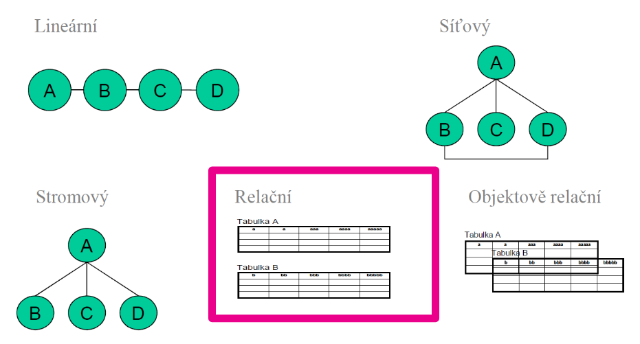

# Agenda

- Základní pojmy
- Model databáze
- Vývoj modelu databáze
- ER diagram

# Základní pojmy

## Data
Údaje, používané pro popis nějakého jevu nebo vlastnosti pozorovaného objektu. Data se získávají zápisem, měřením nebo pozorováním

&nbsp;

## Databáze 
Množina záznamů a objektů (např. tabulek), které jsou organizovány za určitým účelem.

**Předtím**

**Nyní**

#### Přínosy

- Rychlost
- Řízení dat
- Přesnost
- Bezpečnost

#### Druhy

- Relační databáze
- Objektová databáze
- Graph databáze
- atd.

&nbsp;

## Model databáze
Způsob uspořádání a způsob manipulace s daty

- Síťové DBS (1969, 1971)
- Relační (2. pol. 70. let, 80. léta) a objektově relační (90. léta) DBS – ORACLE, Informix, Sybase, MS SQL Server, Progress, DB/2, MySQL, ...
- Objektové DBS (90. léta) – Orion, GemStone, Ontos, Object, Store
- NoSQL DBS (2005+) - BigTable, HBase, SimpleDB, Dynamo

&nbsp;

## Vývoj modelu databáze
### Konceptuální model

- Výběr konceptů
- Volba rozlišení (jaké detaily)

### Logický model

- Identifikace vlastností - převod koncept entita
- Identifikace vazeb - relace s kardinalitami
- Dekompozice - podmínka splnění požadované normální formy

#### Fyzický model

- Způsob fyzického uložení dat
- V případě databází není součástí návrhu

&nbsp;

## Relační model dat

### Postup vytváření

- Vymezit informace, které budeme uchovávat
- Určit vlastnosti, které jsou pro nás důležité, dostupné
- Přemýšlet o tom, jaké jsou mezi objekty vztahy
- Datové modelování = návrh datového modelu (ER diagram)

&nbsp;

### Entity Relationship Diagram
- Design relačních databází
- Logický model

### Pojmy

- **Entita:** věc schopná samostatné existence a je jednoznačně identifikovatelná.
- **Atribut:** vlastnost entity, která nás v kontextu daného problému zajímá.
- **Relace:** vztahy mezi tabulkami.
- **Kardinalita / Multiplicita:** kolikrát se může instance dané entity účastnit vztahu s instancemi druhé entity.
  - 1:1, 1:N, M:N

#### Příklad - Pacient

- Entita Pacient - jaké může mít atributy?

- Uděláme tabulku pacient - co všechno evidujeme o pacientovi?
  - Jméno
  - Příjmení
  - Datum narození
  - Pohlaví

#### Příklady - Střední škola

O studentovi víme, jak se jmenuje, v jakém ročníku je, kdy se narodil a odkud pochází.
Předmět je vypsán pro určitý počet studentů. Má svůj kód. Každý předmět má právě jednoho učitele.  
Každý student studuje několik předmětů. Předmět je vyučován v učebně. Předmět se učí ve specializované učebně (Biologie se nemůže učit v učebně matematiky).
Učitel může učit více předmětů.

**Řešení:** [Lucidchart](https://lucid.app/lucidchart/0c00c625-cd48-422d-b1b1-c17bbdb2cf18/edit?viewport_loc=-908%2C81%2C1664%2C781%2C0_0&invitationId=inv_b76faaf5-ad59-4e93-9636-3784cb722954)

&nbsp;

### Klíče
**Primární klíč (PK)** – jednoznačně identifikuje řádek

**Cizí klíč (FK)** – použitý v dalším výskytu k vyjádření vazeb mezi objekty zachycenými v relační databázi
FK = zkratka z anglického “foreign key”

&nbsp;

## Zdroje pro samostudium (nepovinné)

- [Modelování databází](https://www.root.cz/clanky/modelovani-databazi/)
- [ER Diagrams](https://www.lucidchart.com/pages/er-diagrams)
- [Informační systémy - Databáze](http://lucie.zolta.cz/index.php/iformacni-systemy-databaze/42-relacni-datovy-model)
- [draw.io](https://www.draw.io)
